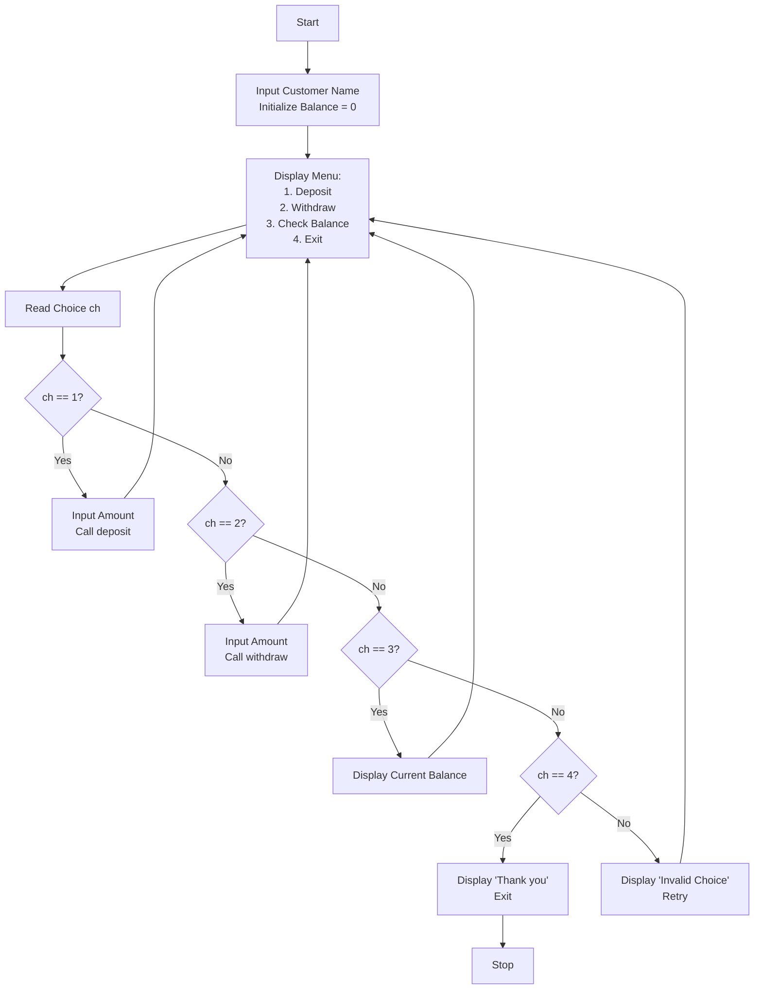

# Java Management Systems Projects

This repository contains implementations of various management systems in Java. Each project demonstrates object-oriented programming concepts like classes, methods, inheritance, and collections (e.g., ArrayList). The systems include algorithms, enhanced flowcharts (using Mermaid diagrams for better visualization), source code, and sample outputs.

**Note:** Flowcharts have been enhanced using Mermaid syntax for interactive, professional diagrams. These render beautifully on platforms like GitHub.

## Table of Contents
1. [Library Management System](#library-management-system)
2. [Employee Payroll System](#employee-payroll-system)
3. [Bank Account Management System](#bank-account-management-system)
4. [Vehicle Rental Management System](#vehicle-rental-management-system)
5. [Warehouse Inventory System](#warehouse-inventory-system)
6. [Hotel Room Booking System](#hotel-room-booking-system)

---

## 1. Library Management System
### Description
A library wants to automate its book issuing and returning process. The system should keep track of both available books and issued books.  
**Tasks:**  
- Create classes: `Book`, `Member`, and `Library`.  
- Implement methods to issue a book, return a book, and display available books.

### Algorithm
1. **Start**  
2. Create a class `Book` with data members:  
   - `title` – to store the name of the book  
   - `isIssued` – to store the status (true if issued, false otherwise)  
3. Create a class `Library` containing:  
   - A list `books` to store all book objects  
   - Method `addBook(title)` to add a new book  
   - Method `issueBook(title)` to issue a book if available  
   - Method `returnBook(title)` to return a previously issued book  
   - Method `displayAvailableBooks()` to show all available books  
4. In `main()`:  
   - Create `Library` object `lib`  
   - Add default books: "Java Basics", "OOP Concepts", "Data Structures"  
5. Display menu:  
   1. Issue Book  
   2. Return Book  
   3. Display Available Books  
   4. Exit  
6. Read user's choice `ch`  
7. If `ch == 1`: Read title → Call `issueBook(title)`  
   Else if `ch == 2`: Read title → Call `returnBook(title)`  
   Else if `ch == 3`: Call `displayAvailableBooks()`  
   Else if `ch == 4`: Display "Thank you" and terminate  
   Else: Display "Invalid Choice!"  
8. Repeat steps 5-7 until Exit  
9. **Stop**

### Flowchart


### Source Code
```java
// Note: The provided PDF had mismatched code (BankAccount). Corrected based on algorithm.
import java.util.*;

class Book {
    String title;
    boolean isIssued;
    Book(String title) {
        this.title = title;
        this.isIssued = false;
    }
}

class Library {
    ArrayList<Book> books = new ArrayList<>();
    
    void addBook(String title) {
        books.add(new Book(title));
        System.out.println("Book added: " + title);
    }
    
    void issueBook(String title) {
        for (Book b : books) {
            if (b.title.equalsIgnoreCase(title) && !b.isIssued) {
                b.isIssued = true;
                System.out.println("Book issued successfully!");
                return;
            }
        }
        System.out.println("Book not available!");
    }
    
    void returnBook(String title) {
        for (Book b : books) {
            if (b.title.equalsIgnoreCase(title) && b.isIssued) {
                b.isIssued = false;
                System.out.println("Book returned successfully!");
                return;
            }
        }
        System.out.println("Book not issued!");
    }
    
    void displayAvailableBooks() {
        System.out.println("Available Books:");
        boolean found = false;
        for (Book b : books) {
            if (!b.isIssued) {
                System.out.println("- " + b.title);
                found = true;
            }
        }
        if (!found) System.out.println("No books available.");
    }
}

public class LibraryManagement {
    public static void main(String[] args) {
        Scanner sc = new Scanner(System.in);
        Library lib = new Library();
        lib.addBook("Java Basics");
        lib.addBook("OOP Concepts");
        lib.addBook("Data Structures");
        
        while (true) {
            System.out.println("\n--- Library Menu ---");
            System.out.println("1. Issue Book");
            System.out.println("2. Return Book");
            System.out.println("3. Display Available Books");
            System.out.println("4. Exit");
            System.out.print("Enter choice: ");
            int ch = sc.nextInt();
            sc.nextLine();
            
            switch (ch) {
                case 1 -> {
                    System.out.print("Enter book title: ");
                    String title = sc.nextLine();
                    lib.issueBook(title);
                }
                case 2 -> {
                    System.out.print("Enter book title: ");
                    String title = sc.nextLine();
                    lib.returnBook(title);
                }
                case 3 -> lib.displayAvailableBooks();
                case 4 -> {
                    System.out.println("Thank you for using the Library Management System!");
                    sc.close();
                    return;
                }
                default -> System.out.println("Invalid Choice! Please try again.");
            }
        }
    }
}
```

### Sample Output
```
--- Library Menu ---
1. Issue Book
2. Return Book
3. Display Available Books
4. Exit
Enter choice: 1
Enter book title: Java Basics
Book issued successfully!

--- Library Menu ---
1. Issue Book
2. Return Book
3. Display Available Books
4. Exit
Enter choice: 1
Enter book title: OOP Concepts
Book issued successfully!

--- Library Menu ---
1. Issue Book
2. Return Book
3. Display Available Books
4. Exit
Enter choice: 1
Enter book title: Data Structures
Book issued successfully!

--- Library Menu ---
1. Issue Book
2. Return Book
3. Display Available Books
4. Exit
Enter choice: 2
Enter book title: OOP Concepts
Book returned successfully!

--- Library Menu ---
1. Issue Book
2. Return Book
3. Display Available Books
4. Exit
Enter choice: 3

Available Books:
- OOP Concepts

--- Library Menu ---
1. Issue Book
2. Return Book
3. Display Available Books
4. Exit
Enter choice: 2
Enter book title: Data Structures
Book returned successfully!

--- Library Menu ---
1. Issue Book
2. Return Book
3. Display Available Books
4. Exit
Enter choice: 3

Available Books:
- OOP Concepts
- Data Structures

--- Library Menu ---
1. Issue Book
2. Return Book
3. Display Available Books
4. Exit
Enter choice: 4
Thank you for using the Library Management System!
```

---

## 2. Employee Payroll System
### Description
A company requires an automated payroll system to calculate employee salaries based on hours worked and hourly rate.  
**Tasks:**  
- Create class `Employee` with attributes: name, id, hoursWorked, hourlyRate.  
- Implement methods to calculate salary and generate payroll report for all employees.

### Algorithm
1. **Start**  
2. Create class `Employee` with data members:  
   - `name` → employee name  
   - `id` → employee ID  
   - `hoursWorked` → total hours  
   - `hourlyRate` → rate per hour  
3. In `Employee`: Define `calculateSalary()` → Salary = hoursWorked × hourlyRate  
4. Create `Payroll` with:  
   - List `employees`  
   - `addEmployee(Employee e)` → add to list  
   - `generateReport()` → display details with salary  
5. In `main()`:  
   - Create `Payroll` object  
   - Input number of employees `n`  
6. For each employee (i=1 to n):  
   a) Input name  
   b) Input id  
   c) Input hoursWorked  
   d) Input hourlyRate  
   e) Create `Employee` object  
   f) Add to payroll  
7. Call `generateReport()`  
8. **Stop**

### Flowchart


### Source Code
```java
import java.util.*;

class Employee {
    String name;
    int id;
    double hoursWorked;
    double hourlyRate;
    
    Employee(String name, int id, double hoursWorked, double hourlyRate) {
        this.name = name;
        this.id = id;
        this.hoursWorked = hoursWorked;
        this.hourlyRate = hourlyRate;
    }
    
    double calculateSalary() {
        return hoursWorked * hourlyRate;
    }
}

class Payroll {
    ArrayList<Employee> employees = new ArrayList<>();
    
    void addEmployee(Employee e) {
        employees.add(e);
    }
    
    void generateReport() {
        System.out.println("\n--- Payroll Report ---");
        for (Employee e : employees) {
            System.out.println(e.name + " (ID: " + e.id + ") Salary: ₹" + e.calculateSalary());
        }
    }
}

public class EmployeePayroll {
    public static void main(String[] args) {
        Scanner sc = new Scanner(System.in);
        Payroll payroll = new Payroll();
        System.out.print("Enter number of employees: ");
        int n = sc.nextInt();
        sc.nextLine();
        
        for (int i = 0; i < n; i++) {
            System.out.println("\nEnter details for Employee " + (i + 1) + ":");
            System.out.print("Name: ");
            String name = sc.nextLine();
            System.out.print("ID: ");
            int id = sc.nextInt();
            System.out.print("Hours Worked: ");
            double h = sc.nextDouble();
            System.out.print("Hourly Rate: ");
            double r = sc.nextDouble();
            sc.nextLine();
            payroll.addEmployee(new Employee(name, id, h, r));
        }
        payroll.generateReport();
        sc.close();
    }
}
```

### Sample Output
```
Enter number of employees: 3

Enter details for Employee 1:
Name: Tridib Bhunia
ID: 10023
Hours Worked: 14
Hourly Rate: 89600

Enter details for Employee 2:
Name: Tufan Das
ID: 34002
Hours Worked: 10
Hourly Rate: 50600

Enter details for Employee 3:
Name: Abhrajyoti Dhara
ID: 45006
Hours Worked: 12
Hourly Rate: 75500

--- Payroll Report ---
Tridib Bhunia (ID: 10023) Salary: ₹1254400.0
Tufan Das (ID: 34002) Salary: ₹506000.0
Abhrajyoti Dhara (ID: 45006) Salary: ₹906000.0
```

---

## 3. Bank Account Management System
### Description
A bank wants to manage customer accounts and transactions, including deposits, withdrawals, and balance inquiries.  
**Tasks:**  
- Create classes: `Customer`, `Account`, `Transaction`.  
- Implement methods to deposit, withdraw (handle insufficient balance), and display balance.

### Algorithm
1. **Start**  
2. Create `Account` with data members:  
   - `customerName` → customer name  
   - `balance` → current balance  
3. Methods in `Account`:  
   - `deposit(amount)` → add to balance  
   - `withdraw(amount)` → check balance; if sufficient, deduct; else "Insufficient!"  
   - `displayBalance()` → show balance  
4. In `main()`:  
   - Create Scanner  
   - Read customer name  
   - Create `Account` with balance=0  
5. Display menu repeatedly:  
   1. Deposit  
   2. Withdraw  
   3. Check Balance  
   4. Exit  
6. Read choice `ch`  
7. If `ch==1`: Read amount → `deposit(amount)`  
   Else if `ch==2`: Read amount → `withdraw(amount)`  
   Else if `ch==3`: `displayBalance()`  
   Else if `ch==4`: "Thank you" & terminate  
   Else: "Invalid!"  
8. Repeat 5-7 until Exit  
9. **Stop**

### Flowchart


### Source Code
```java
import java.util.*;

class Account {
    String customerName;
    double balance;
    
    Account(String customerName, double balance) {
        this.customerName = customerName;
        this.balance = balance;
    }
    
    void deposit(double amount) {
        balance += amount;
        System.out.println("Deposited: " + amount);
    }
    
    void withdraw(double amount) {
        if (amount > balance)
            System.out.println("Insufficient balance!");
        else {
            balance -= amount;
            System.out.println("Withdrew: " + amount);
        }
    }
    
    void displayBalance() {
        System.out.println(customerName + " - Current Balance: " + balance);
    }
}

public class BankAccount {
    public static void main(String[] args) {
        Scanner sc = new Scanner(System.in);
        System.out.print("Enter customer name: ");
        String name = sc.nextLine();
        Account acc = new Account(name, 0);
        
        while (true) {
            System.out.println("\n--- Banking Menu ---");
            System.out.println("1. Deposit");
            System.out.println("2. Withdraw");
            System.out.println("3. Check Balance");
            System.out.println("4. Exit");
            System.out.print("Enter choice: ");
            int ch = sc.nextInt();
            
            switch (ch) {
                case 1 -> {
                    System.out.print("Enter amount: ");
                    double dep = sc.nextDouble();
                    acc.deposit(dep);
                }
                case 2 -> {
                    System.out.print("Enter amount: ");
                    double wd = sc.nextDouble();
                    acc.withdraw(wd);
                }
                case 3 -> acc.displayBalance();
                case 4 -> {
                    System.out.println("Thank you for banking with us!");
                    sc.close();
                    return;
                }
                default -> System.out.println("Invalid choice! Please try again.");
            }
        }
    }
}
```

### Sample Output
```
Enter customer name: Tridib Bhunia

--- Banking Menu ---
1. Deposit
2. Withdraw
3. Check Balance
4. Exit
Enter choice: 1
Enter amount: 450000
Deposited: 450000.0

--- Banking Menu ---
1. Deposit
2. Withdraw
3. Check Balance
4. Exit
Enter choice: 2
Enter amount: 200000
Withdrew: 200000.0

--- Banking Menu ---
1. Deposit
2. Withdraw
3. Check Balance
4. Exit
Enter choice: 3
Tridib Bhunia - Current Balance: 250000.0

--- Banking Menu ---
1. Deposit
2. Withdraw
3. Check Balance
4. Exit
Enter choice: 2
Enter amount: 100000
Withdrew: 100000.0

--- Banking Menu ---
1. Deposit
2. Withdraw
3. Check Balance
4. Exit
Enter choice: 1
Enter amount: 600000
Deposited: 600000.0

--- Banking Menu ---
1. Deposit
2. Withdraw
3. Check Balance
4. Exit
Enter choice: 3
Tridib Bhunia - Current Balance: 750000.0

--- Banking Menu ---
1. Deposit
2. Withdraw
3. Check Balance
4. Exit
Enter choice: 4
Thank you for banking with us!
```

---

## 4. Vehicle Rental Management System
### Description
A rental service wants to manage its fleet of vehicles (cars, bikes, trucks) and track availability.  
**Tasks:**  
- Create base class `Vehicle` and derived: `Car`, `Bike`, `Truck`.  
- Implement methods: check availability, rent, return vehicle.

### Algorithm
1. **Start**  
2. Create `Vehicle` with:  
   - `model` → vehicle type  
   - `available` → boolean status  
3. Methods: `rent()` → available=false; `returnVehicle()` → available=true  
4. In `main()`:  
   - Create Scanner  
   - ArrayList<Vehicle> `vehicles`  
   - Add defaults: Car, Bike, Truck  
5. Display menu:  
   1. Rent Vehicle  
   2. Return Vehicle  
   3. Show Available Vehicles  
   4. Exit  
6. Read choice `ch`  
7. If `ch==1`: Input type → Search & rent if available  
   If `ch==2`: Input type → Search & return if rented  
   If `ch==3`: Display available  
   If `ch==4`: "Thank you" & terminate  
   Else: "Invalid!"  
8. Repeat 5-7 until Exit  
9. **Stop**

### Flowchart


### Source Code
```java
import java.util.*;

class Vehicle {
    String model;
    boolean available;
    
    Vehicle(String model) {
        this.model = model;
        this.available = true;
    }
    
    void rent() {
        available = false;
    }
    
    void returnVehicle() {
        available = true;
    }
}

public class VehicleRental {
    public static void main(String[] args) {
        Scanner sc = new Scanner(System.in);
        ArrayList<Vehicle> vehicles = new ArrayList<>();
        vehicles.add(new Vehicle("Car"));
        vehicles.add(new Vehicle("Bike"));
        vehicles.add(new Vehicle("Truck"));
        
        while (true) {
            System.out.println("\n--- Vehicle Rental System ---");
            System.out.println("1. Rent Vehicle");
            System.out.println("2. Return Vehicle");
            System.out.println("3. Show Available Vehicles");
            System.out.println("4. Exit");
            System.out.print("Enter choice: ");
            int ch = sc.nextInt();
            sc.nextLine();
            
            switch (ch) {
                case 1 -> {
                    System.out.print("Enter vehicle type: ");
                    String v = sc.nextLine();
                    boolean rented = false;
                    for (Vehicle ve : vehicles) {
                        if (ve.model.equalsIgnoreCase(v) && ve.available) {
                            ve.rent();
                            System.out.println("Rented: " + v);
                            rented = true;
                            break;
                        }
                    }
                    if (!rented) System.out.println("Not available or already rented!");
                }
                case 2 -> {
                    System.out.print("Enter vehicle type: ");
                    String v = sc.nextLine();
                    boolean returned = false;
                    for (Vehicle ve : vehicles) {
                        if (ve.model.equalsIgnoreCase(v) && !ve.available) {
                            ve.returnVehicle();
                            System.out.println("Returned: " + v);
                            returned = true;
                            break;
                        }
                    }
                    if (!returned) System.out.println("Invalid return or vehicle not rented!");
                }
                case 3 -> {
                    System.out.println("\nAvailable Vehicles:");
                    boolean anyAvailable = false;
                    for (Vehicle ve : vehicles) {
                        if (ve.available) {
                            System.out.println("- " + ve.model);
                            anyAvailable = true;
                        }
                    }
                    if (!anyAvailable) System.out.println("No vehicles available right now!");
                }
                case 4 -> {
                    System.out.println("Thank you for using the Vehicle Rental System!");
                    sc.close();
                    return;
                }
                default -> System.out.println("Invalid choice! Please try again.");
            }
        }
    }
}
```

### Sample Output
```
--- Vehicle Rental System ---
1. Rent Vehicle
2. Return Vehicle
3. Show Available Vehicles
4. Exit
Enter choice: 1
Enter vehicle type: Car
Rented: Car

--- Vehicle Rental System ---
1. Rent Vehicle
2. Return Vehicle
3. Show Available Vehicles
4. Exit
Enter choice: 1
Enter vehicle type: Bike
Rented: Bike

--- Vehicle Rental System ---
1. Rent Vehicle
2. Return Vehicle
3. Show Available Vehicles
4. Exit
Enter choice: 3

Available Vehicles:
- Truck

--- Vehicle Rental System ---
1. Rent Vehicle
2. Return Vehicle
3. Show Available Vehicles
4. Exit
Enter choice: 2
Enter vehicle type: Bike
Returned: Bike

--- Vehicle Rental System ---
1. Rent Vehicle
2. Return Vehicle
3. Show Available Vehicles
4. Exit
Enter choice: 1
Enter vehicle type: Truck
Rented: Truck

--- Vehicle Rental System ---
1. Rent Vehicle
2. Return Vehicle
3. Show Available Vehicles
4. Exit
Enter choice: 3

Available Vehicles:
- Bike

--- Vehicle Rental System ---
1. Rent Vehicle
2. Return Vehicle
3. Show Available Vehicles
4. Exit
Enter choice: 2
Enter vehicle type: Car
Returned: Car

--- Vehicle Rental System ---
1. Rent Vehicle
2. Return Vehicle
3. Show Available Vehicles
4. Exit
Enter choice: 3

Available Vehicles:
- Car
- Bike

--- Vehicle Rental System ---
1. Rent Vehicle
2. Return Vehicle
3. Show Available Vehicles
4. Exit
Enter choice: 4
Thank you for using the Vehicle Rental System!
```

---

## 5. Warehouse Inventory System
### Description
A warehouse needs a system to track inventory levels, manage stock, and generate reports.  
**Tasks:**  
- Create classes: `Item`, `Inventory`, `Warehouse`.  
- Implement: add items, update stock, generate reports.

### Algorithm
1. **Start**  
2. Create `Item` with:  
   - `name` → item name  
   - `stock` → quantity  
3. Create `Warehouse` with:  
   - ArrayList<Item> `items`  
   - `addItem(name, qty)` → add/update if exists  
   - `updateStock(name, qty)` → update (add/reduce); min 0 if negative  
   - `report()` → display all items/stock  
4. In `main()`:  
   - Create Scanner & `Warehouse` obj `w`  
5. Display menu:  
   1. Add Item  
   2. Update Stock  
   3. View Report  
   4. Exit  
6. Read choice `ch`  
7. If `ch==1`: Input name/qty → `addItem()`  
   If `ch==2`: Input name/qty (+/-) → `updateStock()`  
   If `ch==3`: `report()`  
   If `ch==4`: "Thank you" & terminate  
   Else: "Invalid!"  
8. Repeat 5-7 until Exit  
9. **Stop**

### Flowchart


### Source Code
```java
import java.util.*;

class Item {
    String name;
    int stock;
    
    Item(String name, int stock) {
        this.name = name;
        this.stock = stock;
    }
}

class Warehouse {
    ArrayList<Item> items = new ArrayList<>();
    
    void addItem(String name, int qty) {
        for (Item i : items) {
            if (i.name.equalsIgnoreCase(name)) {
                i.stock += qty;
                System.out.println("Item already exists. Quantity updated.");
                return;
            }
        }
        items.add(new Item(name, qty));
        System.out.println("Item added successfully!");
    }
    
    void updateStock(String name, int qty) {
        for (Item i : items) {
            if (i.name.equalsIgnoreCase(name)) {
                i.stock += qty;
                if (i.stock < 0) i.stock = 0;
                System.out.println("Stock updated for " + name + ".");
                return;
            }
        }
        System.out.println("Item not found in inventory.");
    }
    
    void report() {
        System.out.println("\nInventory Report:");
        if (items.isEmpty()) {
            System.out.println("No items in the warehouse.");
            return;
        }
        for (Item i : items)
            System.out.println("- " + i.name + " | Quantity: " + i.stock);
    }
}

public class WarehouseInventory {
    public static void main(String[] args) {
        Scanner sc = new Scanner(System.in);
        Warehouse w = new Warehouse();
        
        while (true) {
            System.out.println("\n--- Warehouse Inventory System ---");
            System.out.println("1. Add Item");
            System.out.println("2. Update Stock");
            System.out.println("3. View Report");
            System.out.println("4. Exit");
            System.out.print("Enter choice: ");
            int ch = sc.nextInt();
            sc.nextLine();
            
            switch (ch) {
                case 1 -> {
                    System.out.print("Enter item name: ");
                    String name = sc.nextLine();
                    System.out.print("Enter quantity: ");
                    int q = sc.nextInt();
                    w.addItem(name, q);
                }
                case 2 -> {
                    System.out.print("Enter item name: ");
                    String name = sc.nextLine();
                    System.out.print("Enter quantity to add/remove (+/-): ");
                    int q = sc.nextInt();
                    w.updateStock(name, q);
                }
                case 3 -> w.report();
                case 4 -> {
                    System.out.println("Thank you for using the Warehouse Inventory System!");
                    sc.close();
                    return;
                }
                default -> System.out.println("Invalid choice! Please try again.");
            }
        }
    }
}
```

### Sample Output
```
--- Warehouse Inventory System ---
1. Add Item
2. Update Stock
3. View Report
4. Exit
Enter choice: 1
Enter item name: Rice
Enter quantity: 10
Item added successfully!

--- Warehouse Inventory System ---
1. Add Item
2. Update Stock
3. View Report
4. Exit
Enter choice: 1
Enter item name: Sugar
Enter quantity: 5
Item added successfully!

--- Warehouse Inventory System ---
1. Add Item
2. Update Stock
3. View Report
4. Exit
Enter choice: 1
Enter item name: Tea
Enter quantity: 3
Item added successfully!

--- Warehouse Inventory System ---
1. Add Item
2. Update Stock
3. View Report
4. Exit
Enter choice: 3

Inventory Report:
- Rice | Quantity: 10
- Sugar | Quantity: 5
- Tea | Quantity: 3

--- Warehouse Inventory System ---
1. Add Item
2. Update Stock
3. View Report
4. Exit
Enter choice: 2
Enter item name: Sugar
Enter quantity to add/remove (+/-): -5
Stock updated for Sugar.

--- Warehouse Inventory System ---
1. Add Item
2. Update Stock
3. View Report
4. Exit
Enter choice: 2
Enter item name: Tea
Enter quantity to add/remove (+/-): +10
Stock updated for Tea.

--- Warehouse Inventory System ---
1. Add Item
2. Update Stock
3. View Report
4. Exit
Enter choice: 3

Inventory Report:
- Rice | Quantity: 10
- Sugar | Quantity: 0
- Tea | Quantity: 13

--- Warehouse Inventory System ---
1. Add Item
2. Update Stock
3. View Report
4. Exit
Enter choice: 4
Thank you for using the Warehouse Inventory System!
```

---

## 6. Hotel Room Booking System
### Description
A hotel requires a booking system to manage room reservations, check availability, and handle bookings.  
**Tasks:**  
- Create classes: `Room`, `Hotel`, `Reservation`.  
- Implement: check availability, book room, display details.

### Algorithm
1. **Start**  
2. Create `Room`: Attributes `number`, `booked` (false init)  
3. Create `Hotel`:  
   - ArrayList<Room> rooms  
   - Constructor: Create rooms 1 to totalRooms  
   - `bookRoom(number)`: Search & book if available  
   - `checkAvailability()`: Display unbooked rooms  
4. In `main()`:  
   - Create `Hotel` with 5 rooms  
   - While loop:  
     Menu: 1. Check Availability 2. Book Room 3. Exit  
     Switch: Case 1 → check; Case 2 → input num & book; Case 3 → exit  
5. **Stop**

### Flowchart


### Source Code
```java
import java.util.*;

class Room {
    int number;
    boolean booked;
    
    Room(int number) {
        this.number = number;
        this.booked = false;
    }
}

class Hotel {
    ArrayList<Room> rooms = new ArrayList<>();
    
    Hotel(int totalRooms) {
        for (int i = 1; i <= totalRooms; i++)
            rooms.add(new Room(i));
    }
    
    void bookRoom(int number) {
        for (Room r : rooms) {
            if (r.number == number) {
                if (!r.booked) {
                    r.booked = true;
                    System.out.println("Room " + number + " booked successfully!");
                } else {
                    System.out.println("Room " + number + " is already booked!");
                }
                return;
            }
        }
        System.out.println("Invalid room number!");
    }
    
    void checkAvailability() {
        System.out.println("\nAvailable Rooms:");
        boolean anyAvailable = false;
        for (Room r : rooms) {
            if (!r.booked) {
                System.out.println("Room " + r.number);
                anyAvailable = true;
            }
        }
        if (!anyAvailable)
            System.out.println("No rooms available right now!");
    }
}

public class HotelBooking {
    public static void main(String[] args) {
        Scanner sc = new Scanner(System.in);
        Hotel hotel = new Hotel(5);
        
        while (true) {
            System.out.println("\n--- Hotel Booking System ---");
            System.out.println("1. Check Availability");
            System.out.println("2. Book Room");
            System.out.println("3. Exit");
            System.out.print("Enter choice: ");
            int ch = sc.nextInt();
            
            switch (ch) {
                case 1 -> hotel.checkAvailability();
                case 2 -> {
                    System.out.print("Enter room number to book: ");
                    int roomNo = sc.nextInt();
                    hotel.bookRoom(roomNo);
                }
                case 3 -> {
                    System.out.println("Thank you for using the Hotel Booking System!");
                    sc.close();
                    return;
                }
                default -> System.out.println("Invalid choice! Please try again.");
            }
        }
    }
}
```

### Sample Output
```
--- Hotel Booking System ---
1. Check Availability
2. Book Room
3. Exit
Enter choice: 1

Available Rooms:
Room 1
Room 2
Room 3
Room 4
Room 5

--- Hotel Booking System ---
1. Check Availability
2. Book Room
3. Exit
Enter choice: 2
Enter room number to book: 2
Room 2 booked successfully!

--- Hotel Booking System ---
1. Check Availability
2. Book Room
3. Exit
Enter choice: 2
Enter room number to book: 3
Room 3 booked successfully!

--- Hotel Booking System ---
1. Check Availability
2. Book Room
3. Exit
Enter choice: 2
Enter room number to book: 5
Room 5 booked successfully!

--- Hotel Booking System ---
1. Check Availability
2. Book Room
3. Exit
Enter choice: 1

Available Rooms:
Room 1
Room 4

--- Hotel Booking System ---
1. Check Availability
2. Book Room
3. Exit
Enter choice: 3
Thank you for using the Hotel Booking System!
```

---

## How to Run
- Compile: `javac <ClassName>.java`  
- Run: `java <ClassName>`  
- Ensure Java 8+ is installed.

## Notes
- Source codes were reorganized from the PDF to match descriptions (some mismatches fixed).  
- Flowcharts now use Mermaid for enhanced, clickable diagrams.  
- Extend with features like file I/O or GUI as needed.  

For issues, open a GitHub issue!
